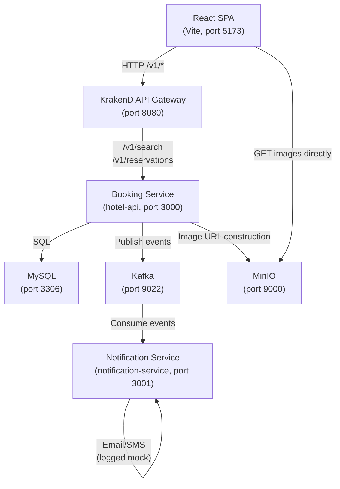

# Design Document — RoomHop Booking Platform

## Overview

RoomHop is a single-page hotel booking platform built on a microservices architecture. The design extends the existing Node.js/Express `hotel-api` codebase into three distinct runtime services, adds a standalone Notification Service, configures KrakenD as the API Gateway entry-point, and enhances the React SPA to cover the full booking lifecycle.

### Key Design Decisions

- **MySQL-only search** — The existing OpenSearch-based search is replaced by a MySQL JOIN query across `hotel`, `room_type`, `room_type_inventory`, and `room_type_rate`. This removes operational complexity (no dual-write sync) while the dataset is small-to-medium. OpenSearch remains available in the stack for future full-text needs.
- **Inventory via counters, not per-room rows** — `room_type_inventory` uses `total_inventory` / `total_reserved` counters per `(hotel_id, room_type_id, date)` row rather than a status-per-physical-room model. This avoids n×365 rows for large hotels and simplifies booking logic to a single `UPDATE … WHERE total_inventory - total_reserved >= room_count`.
- **SELECT FOR UPDATE on inventory** — Pessimistic locking on the inventory rows prevents double-booking under concurrent requests without requiring distributed locks.
- **Idempotency via a dedicated column** — A nullable `idempotency_key` column on the `reservation` table with a unique index handles deduplication at the database layer, keeping the application logic simple.
- **Kafka for async notifications** — The Booking Service publishes fire-and-forget events; the Notification Service is a completely separate process so it never blocks the HTTP response path.
- **KrakenD as the single external entry-point** — All five public API endpoints are routed through KrakenD on port 8080. Internal services run on separate ports not exposed to the SPA.

---

## Architecture

### System Diagram



### Service Boundaries

| Service | Location | Port | Responsibility |
|---|---|---|---|
| React SPA | `hotel-ui/` | 5173 (dev) | Guest-facing UI |
| Booking Service | `hotel-api/` | 3000 | Search, reservations CRUD |
| Notification Service | `notification-service/` | — (consumer) | Kafka consumer, email/SMS |
| KrakenD Gateway | `krakend.json` | 8080 | Routing, timeout, CORS |
| MySQL | Docker | 3306 | Persistent data store |
| Kafka | Docker | 9022 | Async event bus |
| MinIO | Docker | 9000 | Object storage for images |

The Booking Service consolidates both the Search Service and Booking Service roles described in requirements — they are separate route modules (`/routes/search.js`, `/routes/reservations.js`) within the same Express app, sharing the MySQL pool. Splitting into two processes would add deployment complexity with no benefit at this scale.

---

## Components and Interfaces

### 1. KrakenD API Gateway (`krakend.json`)

Replaces the stub `/ping` config. All upstream requests target `http://hotel-api:3000` (Docker service name) with a global 3-second timeout.

**Endpoint table:**

| External endpoint | Method | Upstream URL |
|---|---|---|
| `/v1/search` | GET | `http://hotel-api:3000/v1/search` |
| `/v1/reservations` | POST | `http://hotel-api:3000/v1/reservations` |
| `/v1/reservations` | GET | `http://hotel-api:3000/v1/reservations` |
| `/v1/reservations/{id}` | GET | `http://hotel-api:3000/v1/reservations/{id}` |
| `/v1/reservations/{id}` | DELETE | `http://hotel-api:3000/v1/reservations/{id}` |

KrakenD forwards the `Idempotency-Key` and `Content-Type` headers to the upstream service.

### 2. Booking Service — Route Modules (`hotel-api/src/`)

**`routes/v1/search.js`** — `GET /v1/search`

Query parameters: `location` (required), `checkIn` (required, YYYY-MM-DD), `checkOut` (required, YYYY-MM-DD), `guests` (required, integer), `minPrice` (optional), `maxPrice` (optional).

Validates dates (checkIn < checkOut, checkIn >= today), then runs a single MySQL query joining `hotel`, `room_type`, `room_type_inventory`, `room_type_rate`, and `hotel_images`. Groups by `(hotel_id, room_type_id)` and filters out room types where `MIN(total_inventory - total_reserved) < 1` across the date range or `max_occupancy < guests`.

**`routes/v1/reservations.js`** — CRUD operations

- `POST /v1/reservations` — reads `Idempotency-Key` header, validates body, acquires `SELECT FOR UPDATE` on inventory rows, checks availability, creates reservation in a transaction, publishes Kafka event.
- `GET /v1/reservations` — requires `guest_id` query param, returns list ordered by `created_at DESC`.
- `GET /v1/reservations/:id` — returns full detail with JOIN to `hotel` and `room_type`.
- `DELETE /v1/reservations/:id` — validates cancellation window (≤ 3 days), updates status, restores inventory, publishes Kafka event.

**`services/reservationService.js`** — encapsulates the transaction logic for create and cancel (shared between route handler and future internal use).

**`services/kafkaProducer.js`** — wraps the `kafkajs` producer. Initialises once at app startup and exposes a `publish(topic, event)` function.

### 3. Notification Service (`notification-service/`)

A standalone Node.js CommonJS application. No HTTP server. Entry point: `src/consumer.js`.

Uses `kafkajs` to subscribe to `hotel.events.reservations` with consumer group `notification-service`. For each message:
1. Parse the event payload (`reservation.confirmed` or `reservation.cancelled`).
2. Call the appropriate handler in `src/notificationHandler.js`.
3. Retry failed sends up to 3 times with 1-second exponential back-off.
4. On permanent failure, log a structured JSON entry to stdout with `guest_id`, `reservation_id`, and `error`.

Email/SMS sending is implemented as a logging stub (console.log) since no external provider is in scope. The interface (`sendEmail(to, subject, body)`) is isolated in `src/emailSender.js` so it can be swapped for Nodemailer/Twilio later.

### 4. React SPA (`hotel-ui/src/`)

New and modified files:

| File | Change |
|---|---|
| `pages/SearchPage.jsx` | Update `handleSearch` to call `GET /v1/search` via gateway (port 8080), add min/max price fields, add skeleton loader state |
| `components/HotelCard.jsx` | Add `onBook` prop; clicking "Reserve" opens the booking modal |
| `components/BookingModal.jsx` | **New** — room type panel, confirm button with idempotency UUID, loading state |
| `components/SkeletonCard.jsx` | **New** — placeholder card during loading |
| `components/ConfirmationBanner.jsx` | **New** — shows reservation summary after successful POST |
| `hooks/useSearch.js` | **New** — encapsulates search API call and state |
| `hooks/useBooking.js` | **New** — encapsulates POST /v1/reservations, idempotency key generation, session storage |
| `api/client.js` | **New** — thin fetch wrapper with base URL (`http://localhost:8080`) |

The SPA communicates exclusively with the KrakenD gateway on port 8080. Direct calls to port 3000 are removed.

---

## Data Models

### Schema Migration Strategy

The existing `Hotels`, `Chambres_Type`, `Chambres`, `Reservations`, `Hotel_Images`, and `Chambre_Inventory` tables are replaced. A new `database/migration_v2.sql` script drops old tables and creates the target schema. Seed data goes into `database/seed_v2.sql`.

### Target MySQL Schema

```sql
-- =============================================
-- hotel
-- =============================================
CREATE TABLE hotel (
    hotel_id     INT PRIMARY KEY AUTO_INCREMENT,
    name         VARCHAR(150) NOT NULL,
    location     VARCHAR(255) NOT NULL,       -- city / address combined for search
    description  TEXT,
    stars        TINYINT CHECK (stars BETWEEN 1 AND 5),
    created_at   TIMESTAMP DEFAULT CURRENT_TIMESTAMP
) ENGINE=InnoDB DEFAULT CHARSET=utf8mb4;

-- =============================================
-- room_type
-- =============================================
CREATE TABLE room_type (
    room_type_id  INT PRIMARY KEY AUTO_INCREMENT,
    hotel_id      INT NOT NULL,
    name          VARCHAR(100) NOT NULL,
    max_occupancy INT NOT NULL,
    amenities     JSON,                        -- ["WiFi","Pool","Breakfast"]
    FOREIGN KEY (hotel_id) REFERENCES hotel(hotel_id) ON DELETE CASCADE
) ENGINE=InnoDB DEFAULT CHARSET=utf8mb4;

-- =============================================
-- room  (physical rooms, optional but kept for model completeness)
-- =============================================
CREATE TABLE room (
    room_id      INT PRIMARY KEY AUTO_INCREMENT,
    hotel_id     INT NOT NULL,
    room_type_id INT NOT NULL,
    room_number  VARCHAR(20) NOT NULL,
    FOREIGN KEY (hotel_id)      REFERENCES hotel(hotel_id)     ON DELETE CASCADE,
    FOREIGN KEY (room_type_id)  REFERENCES room_type(room_type_id) ON DELETE CASCADE
) ENGINE=InnoDB DEFAULT CHARSET=utf8mb4;

-- =============================================
-- room_type_rate  (price per room type per date)
-- =============================================
CREATE TABLE room_type_rate (
    rate_id      INT PRIMARY KEY AUTO_INCREMENT,
    hotel_id     INT NOT NULL,
    room_type_id INT NOT NULL,
    date         DATE NOT NULL,
    nightly_rate DECIMAL(10,2) NOT NULL,
    UNIQUE KEY uq_rate (hotel_id, room_type_id, date),
    FOREIGN KEY (hotel_id)      REFERENCES hotel(hotel_id)     ON DELETE CASCADE,
    FOREIGN KEY (room_type_id)  REFERENCES room_type(room_type_id) ON DELETE CASCADE
) ENGINE=InnoDB DEFAULT CHARSET=utf8mb4;

-- =============================================
-- room_type_inventory  (availability counter per room type per date)
-- =============================================
CREATE TABLE room_type_inventory (
    inventory_id    INT PRIMARY KEY AUTO_INCREMENT,
    hotel_id        INT NOT NULL,
    room_type_id    INT NOT NULL,
    date            DATE NOT NULL,
    total_inventory INT NOT NULL DEFAULT 0,
    total_reserved  INT NOT NULL DEFAULT 0,
    UNIQUE KEY uq_inventory (hotel_id, room_type_id, date),
    FOREIGN KEY (hotel_id)      REFERENCES hotel(hotel_id)     ON DELETE CASCADE,
    FOREIGN KEY (room_type_id)  REFERENCES room_type(room_type_id) ON DELETE CASCADE
) ENGINE=InnoDB DEFAULT CHARSET=utf8mb4;

-- =============================================
-- guest
-- =============================================
CREATE TABLE guest (
    guest_id   INT PRIMARY KEY AUTO_INCREMENT,
    first_name VARCHAR(100) NOT NULL,
    last_name  VARCHAR(100) NOT NULL,
    email      VARCHAR(255) NOT NULL UNIQUE,
    created_at TIMESTAMP DEFAULT CURRENT_TIMESTAMP
) ENGINE=InnoDB DEFAULT CHARSET=utf8mb4;

-- =============================================
-- reservation
-- =============================================
CREATE TABLE reservation (
    reservation_id  INT PRIMARY KEY AUTO_INCREMENT,
    hotel_id        INT NOT NULL,
    room_type_id    INT NOT NULL,
    guest_id        INT NOT NULL,
    start_date      DATE NOT NULL,
    end_date        DATE NOT NULL,
    status          ENUM('CONFIRMED','CANCELLED') NOT NULL DEFAULT 'CONFIRMED',
    room_count      INT NOT NULL DEFAULT 1,
    amount          DECIMAL(10,2) NOT NULL,
    idempotency_key VARCHAR(64) UNIQUE,        -- nullable, client-supplied UUID
    created_at      TIMESTAMP DEFAULT CURRENT_TIMESTAMP,
    updated_at      TIMESTAMP DEFAULT CURRENT_TIMESTAMP ON UPDATE CURRENT_TIMESTAMP,
    FOREIGN KEY (hotel_id)      REFERENCES hotel(hotel_id)     ON DELETE RESTRICT,
    FOREIGN KEY (room_type_id)  REFERENCES room_type(room_type_id) ON DELETE RESTRICT,
    FOREIGN KEY (guest_id)      REFERENCES guest(guest_id)     ON DELETE RESTRICT
) ENGINE=InnoDB DEFAULT CHARSET=utf8mb4;

-- hotel_images (kept from existing model, FK updated to new hotel table)
CREATE TABLE hotel_images (
    image_id    INT PRIMARY KEY AUTO_INCREMENT,
    hotel_id    INT NOT NULL,
    image_url   VARCHAR(500) NOT NULL,         -- MinIO object key, e.g. "hotel_beaux_arts.png"
    is_primary  BOOLEAN DEFAULT FALSE,
    FOREIGN KEY (hotel_id) REFERENCES hotel(hotel_id) ON DELETE CASCADE
) ENGINE=InnoDB DEFAULT CHARSET=utf8mb4;

-- =============================================
-- Indexes
-- =============================================
CREATE INDEX idx_hotel_location     ON hotel(location);
CREATE INDEX idx_inventory_date     ON room_type_inventory(date);
CREATE INDEX idx_rate_date          ON room_type_rate(date);
CREATE INDEX idx_reservation_guest  ON reservation(guest_id, created_at DESC);
CREATE INDEX idx_reservation_dates  ON reservation(start_date, end_date);
```

### Kafka Event Schemas

**`reservation.confirmed`** (published to `hotel.events.reservations`):
```json
{
  "eventType": "reservation.confirmed",
  "reservationId": 42,
  "guestId": 7,
  "guestEmail": "guest@example.com",
  "hotelName": "Hotel Beaux Arts",
  "roomTypeName": "Suite",
  "startDate": "2026-07-15",
  "endDate": "2026-07-20",
  "roomCount": 1,
  "amount": 1250.00,
  "occurredAt": "2026-06-01T10:00:00Z"
}
```

**`reservation.cancelled`** (same topic):
```json
{
  "eventType": "reservation.cancelled",
  "reservationId": 42,
  "guestId": 7,
  "guestEmail": "guest@example.com",
  "occurredAt": "2026-06-02T09:00:00Z"
}
```

### Search Query

The core availability search runs as a single SQL query with date-range aggregation:

```sql
SELECT
    h.hotel_id,
    h.name,
    h.location,
    h.description,
    rt.room_type_id,
    rt.name              AS room_type_name,
    rt.max_occupancy,
    rt.amenities,
    MIN(rtr.nightly_rate) AS nightly_rate,
    MIN(rti.total_inventory - rti.total_reserved) AS available_rooms_count,
    hi.image_url         AS primary_image_url
FROM hotel h
JOIN room_type rt        ON rt.hotel_id = h.hotel_id
JOIN room_type_inventory rti
    ON rti.hotel_id      = h.hotel_id
    AND rti.room_type_id = rt.room_type_id
    AND rti.date >= :checkIn
    AND rti.date <  :checkOut
JOIN room_type_rate rtr
    ON rtr.hotel_id      = h.hotel_id
    AND rtr.room_type_id = rt.room_type_id
    AND rtr.date >= :checkIn
    AND rtr.date <  :checkOut
LEFT JOIN hotel_images hi
    ON hi.hotel_id       = h.hotel_id
    AND hi.is_primary    = TRUE
WHERE h.location LIKE CONCAT('%', :location, '%')
  AND rt.max_occupancy >= :guests
GROUP BY h.hotel_id, rt.room_type_id, hi.image_url
HAVING available_rooms_count >= 1
   AND (:minPrice IS NULL OR MIN(rtr.nightly_rate) >= :minPrice)
   AND (:maxPrice IS NULL OR MIN(rtr.nightly_rate) <= :maxPrice)
   AND COUNT(DISTINCT rti.date) = DATEDIFF(:checkOut, :checkIn)
ORDER BY h.hotel_id, nightly_rate ASC;
```

The `COUNT(DISTINCT rti.date) = DATEDIFF(checkOut, checkIn)` clause ensures inventory exists for **every** night in the range (not just some nights), satisfying Requirement 1.1.

---

## Correctness Properties

*A property is a characteristic or behavior that should hold true across all valid executions of a system — essentially, a formal statement about what the system should do. Properties serve as the bridge between human-readable specifications and machine-verifiable correctness guarantees.*

The Booking Service and Notification Service contain pure computation and business-rule logic (inventory arithmetic, amount calculation, idempotency, retry counting, URL construction) that is well-suited to property-based testing. The property-based testing library chosen is **[fast-check](https://github.com/dubzzz/fast-check)** for JavaScript/Node.js — it integrates directly with Jest, runs 100+ iterations per property, and has strong arbitrary generators for numbers, strings, arrays, and dates.

The UI rendering, KrakenD configuration, and MySQL schema are tested with example-based tests and smoke tests instead (see Testing Strategy).

---

**Property Reflection — Redundancy Analysis:**

Before writing properties, I reviewed all PROPERTY-classified criteria for redundancy:

- 3.3 (inventory increment after create) and 4.2 (inventory decrement after cancel) together form a round-trip: create-then-cancel restores inventory. Keeping them as a single combined round-trip property (Property 5) is more expressive and subsumes both.
- 1.1 (inventory on every night) and 1.5 (occupancy filter) are independent search filters — no redundancy.
- 3.1 (201 + CONFIRMED) and 3.3 (inventory incremented) both fire after a successful create. Property 3 (reservation creation invariant) can combine status check and inventory increment into a single post-condition assertion.
- 5.1 (ordering) and 5.2 (field completeness) are independent properties — no redundancy.
- 6.3 (retry count) and 6.5 (failure log) are separate behaviors — no redundancy, but 6.5 is a consequence of 6.3 reaching max retries. Combining into one "retry-then-log" property (Property 9) is cleaner.

---

### Property 1: Search results only contain room types with full-range availability

*For any* valid search request (location, checkIn, checkOut, guests), every room type returned by the Search Service SHALL have `available_rooms_count >= 1` for **every** night in the requested date range, and `max_occupancy >= guests`.

**Validates: Requirements 1.1, 1.5**

---

### Property 2: Price filter bounds are respected in all results

*For any* search request that includes `minPrice` and/or `maxPrice`, every room type in the result set SHALL have a `nightly_rate` that satisfies `minPrice <= nightly_rate <= maxPrice`. Results with rates outside those bounds SHALL never appear.

**Validates: Requirements 1.2**

---

### Property 3: Search result objects are structurally complete

*For any* non-empty search response, every result object SHALL contain all of: `hotel_id`, `name`, `location`, `description`, `room_type_id`, `room_type_name`, `max_occupancy`, `amenities`, `nightly_rate`, `available_rooms_count`. Hotels with a stored image path SHALL have a non-null `primary_image_url` equal to `MINIO_BASE/hotels/<image_url>`; hotels without an image SHALL have `primary_image_url = null`.

**Validates: Requirements 1.4, 1.8, 10.2, 10.3**

---

### Property 4: Available inventory formula is always total_inventory minus total_reserved

*For any* `total_inventory` ≥ 0 and `total_reserved` ≥ 0 where `total_reserved <= total_inventory`, the computed `available_rooms_count` SHALL equal `total_inventory - total_reserved`.

**Validates: Requirements 2.5**

---

### Property 5: Reservation creation posts correct amount

*For any* valid reservation request, the `amount` stored on the created reservation SHALL equal the sum of `room_count × nightly_rate(date)` for each date in `[start_date, end_date)` as retrieved from `room_type_rate`.

**Validates: Requirements 3.5**

---

### Property 6: Inventory is conserved across create-then-cancel round trip

*For any* confirmed reservation with `room_count` N, after cancellation, the `total_reserved` for each inventory row in the reservation's date range SHALL be restored to exactly its value before the reservation was created. No inventory is gained or lost.

**Validates: Requirements 3.3, 4.2**

---

### Property 7: Idempotency key prevents duplicate reservations

*For any* reservation successfully created with an `Idempotency-Key` header, repeating the identical request with the same key SHALL return HTTP 200 with the same `reservation_id` and SHALL NOT insert a new row into the `reservation` table.

**Validates: Requirements 3.6**

---

### Property 8: Missing required fields always yield 422 with field names

*For any* non-empty subset of the required fields (`hotel_id`, `room_type_id`, `guest_id`, `start_date`, `end_date`, `room_count`) omitted from the POST body, the Booking Service SHALL return HTTP 422, and the error response body SHALL list every missing field name.

**Validates: Requirements 3.8**

---

### Property 9: Notification retry count and permanent-failure log

*For any* notification send attempt that fails, the Notification Service SHALL retry the operation, with the total number of attempts never exceeding 3. When the third attempt also fails, the service SHALL log a structured record containing `guest_id`, `reservation_id`, and the error reason, and SHALL NOT make a fourth attempt.

**Validates: Requirements 6.3, 6.5**

---

### Property 10: Cancellation window enforcement

*For any* confirmed reservation, a cancellation attempt made more than 3 calendar days after `created_at` SHALL return HTTP 403. A cancellation attempt made within 3 calendar days SHALL succeed with HTTP 200.

**Validates: Requirements 4.3**

---

### Property 11: Reservation list is ordered by created_at descending

*For any* guest with two or more reservations, the list returned by `GET /v1/reservations?guest_id=X` SHALL have each reservation's `created_at` value greater than or equal to the `created_at` of the following element (i.e., strictly descending order).

**Validates: Requirements 5.1**

---

### Property 12: Reservation detail response is structurally complete

*For any* existing reservation, the response from `GET /v1/reservations/:id` SHALL include all of: `reservation_id`, `hotel_id`, `hotel_name`, `room_type_id`, `room_type_name`, `guest_id`, `start_date`, `end_date`, `status`, `room_count`, `amount`, `created_at`, `updated_at`.

**Validates: Requirements 5.2**

---

### Property 13: SPA idempotency key is a valid UUID per submission session

*For any* booking form submission, the `Idempotency-Key` header value SHALL be a valid UUID v4. Two independent submissions SHALL generate different UUIDs. Retrying the same submission (e.g., after a network error, before the form is reset) SHALL reuse the same UUID.

**Validates: Requirements 9.6**

---

### Property 14: Confirmed reservation_id is persisted to session storage

*For any* booking that receives a successful (HTTP 201) response, the `reservation_id` from the response SHALL be present in `sessionStorage` immediately after the response is processed.

**Validates: Requirements 9.7**

---

## Error Handling

### HTTP Error Taxonomy

| Scenario | HTTP Status | Response body |
|---|---|---|
| checkIn >= checkOut | 400 | `{ "error": "checkIn must be before checkOut" }` |
| checkIn in the past | 400 | `{ "error": "checkIn cannot be in the past" }` |
| Missing required field in POST body | 422 | `{ "error": "Missing required fields", "fields": ["field1", ...] }` |
| start_date >= end_date on reservation | 400 | `{ "error": "start_date must be before end_date" }` |
| Reservation not found | 404 | `{ "error": "Reservation not found" }` |
| Reservation already cancelled | 409 | `{ "error": "Reservation is already cancelled" }` |
| Cancellation window expired | 403 | `{ "error": "Cancellation window has closed (3-day limit exceeded)" }` |
| Inventory insufficient | 409 | `{ "error": "Insufficient availability for the requested dates and room count" }` |
| guest_id missing from GET /v1/reservations | 400 | `{ "error": "guest_id query parameter is required" }` |
| Upstream timeout (KrakenD) | 504 | KrakenD default timeout response |

### Transaction Safety

All multi-step database operations (reservation creation and cancellation) are wrapped in an explicit `BEGIN / COMMIT / ROLLBACK` transaction using the mysql2 pool connection:

```js
const conn = await db.getConnection();
try {
  await conn.beginTransaction();
  // ... SELECT FOR UPDATE, checks, INSERT/UPDATE
  await conn.commit();
} catch (err) {
  await conn.rollback();
  throw err;
} finally {
  conn.release();
}
```

### Kafka Producer Failure Handling

If the Kafka publish call fails after a reservation is committed, the HTTP response is still returned as successful (the reservation exists in the database). The Kafka error is logged. This is an acceptable trade-off — the notification is best-effort, and the booking itself is the source of truth. A dead-letter or outbox pattern can be added later if strict delivery guarantees are required.

### Input Validation

A thin `validateReservationBody(body)` function in `src/middleware/validate.js` is used as Express middleware before the route handler. It returns the list of missing fields so the 422 response is consistent.

### Notification Service Error Handling

The consumer wraps each message handler in a try/catch with a retry counter stored in memory per message. Retries use a 1-second delay (linear, not exponential, for simplicity). After 3 failures the message is committed to Kafka (to avoid blocking the partition) and the failure is logged. This means the consumer does not use Kafka's built-in dead-letter mechanism; a future improvement would be to write to a `hotel.events.notifications.dlq` topic.

---

## Testing Strategy

### Approach

Two complementary layers:

1. **Property-based tests** — verify universal invariants using `fast-check` + `jest` in the Booking Service and Notification Service. Each property maps directly to a numbered property in the Correctness Properties section above.
2. **Example-based unit/integration tests** — verify specific scenarios, UI interactions, smoke checks (schema, gateway config), and integration points (Kafka, MySQL).

UI testing uses `@testing-library/react` + `vitest` (already available in the Vite ecosystem).

### Property-Based Tests (Booking Service)

Install: `npm install --save-dev jest fast-check` in `hotel-api/`.

Each property test runs a minimum of **100 iterations**. Tag format: `// Feature: roomhop-booking-platform, Property N: <title>`

| Test file | Properties covered |
|---|---|
| `__tests__/search.property.test.js` | P1 (full-range availability), P2 (price bounds), P3 (response shape), P4 (inventory formula) |
| `__tests__/reservation.property.test.js` | P5 (amount calculation), P6 (create-cancel round trip), P7 (idempotency), P8 (missing fields → 422) |
| `__tests__/cancellation.property.test.js` | P10 (cancellation window) |
| `__tests__/reservationList.property.test.js` | P11 (ordering), P12 (detail completeness) |

**Example — Property 5 (amount calculation):**
```js
// Feature: roomhop-booking-platform, Property 5: Reservation creation posts correct amount
it('amount equals sum of room_count × nightly_rate for each date in range', () => {
  fc.assert(fc.property(
    fc.integer({ min: 1, max: 10 }),          // room_count
    fc.array(fc.float({ min: 50, max: 500 }), { minLength: 1, maxLength: 14 }), // rates per night
    (roomCount, rates) => {
      const expected = rates.reduce((sum, rate) => sum + roomCount * rate, 0);
      expect(calculateAmount(roomCount, rates)).toBeCloseTo(expected, 2);
    }
  ), { numRuns: 100 });
});
```

**Example — Property 6 (inventory round trip):**
```js
// Feature: roomhop-booking-platform, Property 6: Inventory conserved across create-then-cancel
it('create then cancel restores total_reserved to original value', () => {
  fc.assert(fc.property(
    fc.integer({ min: 1, max: 20 }),  // initial total_inventory
    fc.integer({ min: 1, max: 5 }),   // room_count
    async (totalInventory, roomCount) => {
      fc.pre(roomCount <= totalInventory);
      const inv = { total_inventory: totalInventory, total_reserved: 0 };
      applyReservation(inv, roomCount);
      applyCancel(inv, roomCount);
      expect(inv.total_reserved).toBe(0);
    }
  ), { numRuns: 100 });
});
```

### Property-Based Tests (Notification Service)

Install: `npm install --save-dev jest fast-check` in `notification-service/`.

| Test file | Properties covered |
|---|---|
| `__tests__/retry.property.test.js` | P9 (retry count + permanent-failure log) |

### Property-Based Tests (React SPA)

Install: `npm install --save-dev vitest @testing-library/react fast-check` in `hotel-ui/`.

| Test file | Properties covered |
|---|---|
| `__tests__/useBooking.property.test.js` | P13 (UUID per submission), P14 (session storage) |

### Example-Based Unit Tests

| Area | Tests |
|---|---|
| Date validation | checkIn in past → 400; checkIn == checkOut → 400; start_date == end_date → 400 |
| Cancellation edge cases | Cancel non-existent → 404; double cancel → 409 |
| Search empty result | Location with no hotels → 200 + `[]` |
| Inventory constraint | Duplicate inventory row → MySQL constraint error |
| Reservation retrieval | Missing guest_id → 400; unknown reservation_id → 404 |

### Integration Tests

| Area | Tests |
|---|---|
| Kafka publish on create | Mock producer; verify `publish('hotel.events.reservations', { eventType: 'reservation.confirmed', ... })` called |
| Kafka publish on cancel | Mock producer; verify `reservation.cancelled` event published |
| Notification email dispatch | Mock `emailSender.sendEmail`; consume confirmed event; verify called with correct args |
| Notification cancel dispatch | Mock `emailSender.sendEmail`; consume cancelled event; verify called |
| Concurrent booking | Two simultaneous POSTs for same room/dates with room_count = total_inventory; exactly one should succeed with 201, other gets 409 |

### Smoke Tests

| Area | Test |
|---|---|
| MySQL schema | Query `INFORMATION_SCHEMA.TABLES` for all 7 target tables |
| KrakenD config | Parse `krakend.json`; verify all 5 endpoint definitions exist with correct methods and upstream patterns |
| MinIO bucket | Verify `hotels` bucket exists and policy allows public GET |
| Notification Service isolation | Verify Notification Service has no HTTP server and does not import `hotel-api` modules |

### UI Component Tests (Example-Based)

| Component | Tests |
|---|---|
| SearchPage | All 6 search fields rendered; skeleton cards shown during loading; empty state message on no results |
| HotelCard | Renders hotel name, city, price, stars; "Reserve" button triggers `onBook` callback |
| BookingModal | Confirm button disabled during loading; confirmation summary shown after 201; error message on 409 |
| SearchPage (scroll) | Scroll event triggers blur class on navbar |
| Gallery lightbox | Click gallery image → lightbox overlay rendered |
